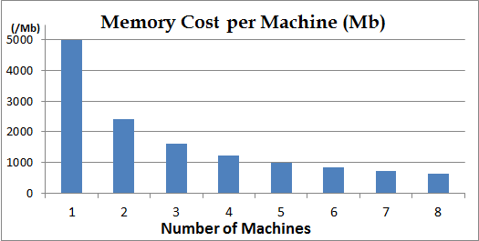
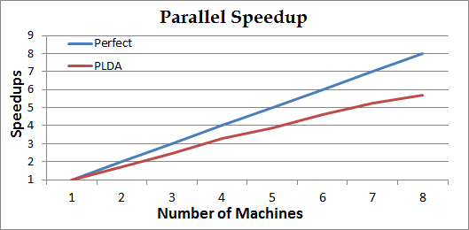

# Introduction #

Welcome to PLDA.

PLDA is a parallel C++ implementation of Latent Dirichlet Allocation (LDA) [1,2]. We are expecting to present a highly optimized parallel implemention of the Gibbs sampling algorithm for the training/inference of LDA [3]. The carefully designed architecture is expected to support extensions of this algorithm.

We will release an enhanced parallel implementation of LDA, named as PLDA+ [2], which can improve scalability of LDA by significantly reducing the unparallelizable communication bottleneck and achieve good load balancing.

PLDA is a free software. Please see COPYING for details.

# Requirement #
Parallel lda must be run in linux environment with g++ compiler and [mpich](https://www.mpich.org/) installed.

# Quick Start #
  * Use Docker to simulate parallel environment.  
    ```
    cd plda/docker
    ./run_docker.sh 3  # pass in the number of mpi nodes
    ```

    It will first build the PLDA image, then create a container as "master" and two other containers named plda-node-1 and plda-node-2, respectively. After the containers started, the master will start training in these nodes.

  * Visualization  
      We recommend that you use [Weave Scope](https://www.weave.works/products/weave-scope/) to monitor Docker containers.  
      Please refer to [install weave scope](https://www.weave.works/install-weave-scope/).

# Installation #
### Install MPICH
* Download the latest mpich [here](https://www.mpich.org/downloads/), and install.  

### Install PLDA
* Download and build plda

    ```
    git clone https://github.com/obdg/plda.git  
    cd plda  
    make all
    ```

* You will see a binary file `lda`, `mpi_lda` and `infer` generated in the folder
* We use mpich builtin compiler mpicxx to compile, it is a wrap of g++.

# Data Format #
  * Data is stored using a sparse representation, with one document per line. Each line is the words of this document together with the word count. The format of the data file is:

    ```
    <word1> <word1_count> <word2> <word2_count> <word3> <word3_count> ...
    .
    .
    .
    ```
  * Each word is an arbitrary string, but it is not expected to contain space/newline or other special characters.
  * Example: Suppose there are two documents. The first one is `"a is a character"`; The second one is `"b is a character after a"`. Then the datafile would look like:

    ```
    a 2 is 1 character 1
    a 2 is 1 b 1 character 1 after 1
    ```

# Usage #
### Train ###
  * Train  
      * Prepare data as described in section "Data Format".
      * `./lda --num_topics 2 --alpha 0.1 --beta 0.01 --training_data_file testdata/test_data.txt --model_file /tmp/lda_model.txt --burn_in_iterations 100 --total_iterations 150`


  * Train parallelly
      * Prepare data the same as the single processor version.
      * `mpiexec -n 5 ./mpi_lda --num_topics 2 --alpha 0.1 --beta 0.01 --training_data_file testdata/test_data.txt --model_file /tmp/lda_model.txt --total_iterations 150`
      * The input and output are the same with single processor version.


  * Training flags
      * `alpha`: Suggested to be 50/number\_of\_topics
      * `beta`: Suggested to be 0.01
      * `num_topics`: The total number of topics.
      * `total_iterations`: The total number of GibbsSampling iterations.
      * `burn_in_iterations`: After --burn\_in\_iterations iteration, the model will be almost converged. Then we will average models of the last (total\_iterations-burn\_in\_iterations) iterations as the final model. This only takes effect for single processor version. For example: you set total\_iterations to 200, you found that after 170 iterations, the model is almost converged. Then you could set burn\_in\_iterations to 170 so that the final model will be the average of the last 30 iterations.
      * `model_file`: The output file of the trained model.
      * `training_data_file`: The training data.


  * Trained Model
      * After training completes, you will see a file `/tmp/lda_model.txt` generated. This file stores the training result. Each line is the topic distribution of a word. The first element is the word string, then its occurrence count within each topic.
      * You could use view\_model.py to convert the model to a readable text.

### Infer ###
  * Infer unseen documents:
      * `./infer --alpha 0.1 --beta 0.01 --inference_data_file testdata/test_data.txt --inference_result_file /tmp/inference_result.txt --model_file /tmp/lda_model.txt --total_iterations 15 --burn_in_iterations 10`


  * Inferring flags:
      * `alpha` and `beta` should be the same with training.
      * `total_iterations`: The total number of GibbsSampling iterations for an unseen document to determine its word topics. This number needs not be as much as training, usually tens of iterations is enough.
      * `burn_in_iterations`: For an unseen document, we will average the document\_topic\_distribution of the last (total\_iterations-burn\_in\_iterations) iterations as the final document\_topic\_distribution.


# Example #
  Here we provide an simple example using the PLDA and New York Times news articles to train a topic model.

  * Download data  
     We use [Bag of Words Data Set](https://archive.ics.uci.edu/ml/datasets/Bag+of+Words) created by David Newman, UCI. This dataset contains five text collections in the form of bags-of-words. We use the New York Times news articles collection which includes 300000 documents, 102660 words in the vocabulary. The total number of words in this collection is approximately 100,000,000. The stopwords have been removed.  
    ```
    cd plda/testdata
    ./get_NYTimes.sh
    ```

  * Change the data to the proper format as described above.  
      `./format.py nytimes`  
     Because the dataset is big, this step will take several minutes. It will create an single training data file named "nytimes.txt".

  * Train parallelly  
     We ran the example on a mpi-cluster with 8 machines, each with a Intel Xeon CPU E5-1410(2.8GHz) and 16GB of memory.   
     `mpiexec -n 8 ./mpi_lda --num_topics 10 --alpha 0.1 --beta 0.01 --training_data_file testdata/nytimes.txt --model_file /tmp/ny_model_8.txt --burn_in_iterations 100 --total_iterations 150`  
     **Note:** The above executing command can be ran from any of the 8 hosts, but the date set(nytimes.txt) should be copied to the identical location of all the hosts.

  * Training performance  
     Also, we ran the same example with different number of machines from 1~8 on the same cluster, and here is the results:   
     * Memory:  

         

       *1. The memory cost is almost linearly reduced as the number of the machines increase.*  
       *2. During running time, all the documents are distributely stored. If your corpus is huge, you could add more machines.*  
       *3. The memory cost is NUM_VOCABULARY * NUM_TOPICS * sizeof(int64) bytes, and you have to make sure the sum of all machines' memory must be greater than this. If not, you have to reduce your vocabulary size or reduce num_topics.*

     * Speedup:  

        

      *1. The curv Perfect is the base-line of linear speedup to compare.*  
      *2. For each iteration, all computers do GibbsSampling parallelly. At the end of iterations, they reduces updated model. Generally, if the corpus is large and the model is small, the speedup is almost linear. If the model is large and the corpus is small, the speedup may be worse than linear.*  
      *3. The performance may also be infected by the conditions of network/computing resource of the mpi-cluster.*

  * View Model  
    We can view the trained mobel using view\_model.py to convert the model to a readable text.  
    `./view_model.py /tmp/ny_model_8.txt`  
    And we selete some words from it in each topic as shown in below table:

<table>
  <tr>
    <th align="center">Topic<br>0</th>
    <th align="center">Topic<br>1</th>
    <th align="center">Topic<br>2</th>
    <th align="center">Topic<br>3</th>
    <th align="center">Topic<br>4</th>
    <th align="center">Topic<br>5</th>
    <th align="center">Topic<br>6</th>
    <th align="center">Topic<br>7</th>
    <th align="center">Topic<br>8</th>
    <th align="center">Topic<br>9</th>
  </tr>
  <tr>
    <td align="center">law</td>
    <td align="center">president</td>
    <td align="center">food</td>
    <td align="center">government</td>
    <td align="center">patient</td>
    <td align="center">com</td>
    <td align="center">company</td>
    <td align="center">team</td>
    <td align="center">show</td>
    <td align="center">school</td>
  </tr>
  <tr>
    <td align="center">case</td>
    <td align="center">election</td>
    <td align="center">cup</td>
    <td align="center">official</td>
    <td align="center">drug</td>
    <td align="center">web</td>
    <td align="center">million</td>
    <td align="center">game</td>
    <td align="center">film</td>
    <td align="center">student</td>
  </tr>
  <tr>
    <td align="center">court</td>
    <td align="center">political</td>
    <td align="center">water</td>
    <td align="center">military</td>
    <td align="center">doctor</td>
    <td align="center">computer</td>
    <td align="center">market</td>
    <td align="center">season</td>
    <td align="center">movie</td>
    <td align="center">children</td>
  </tr>
  <tr>
    <td align="center">lawer</td>
    <td align="center">campaign</td>
    <td align="center">restaurant</td>
    <td align="center">attack</td>
    <td align="center">cell</td>
    <td align="center">site</td>
    <td align="center">stock</td>
    <td align="center">player</td>
    <td align="center">music</td>
    <td align="center">family</td>
  </tr>
  <tr>
    <td align="center">police</td>
    <td align="center">vote</td>
    <td align="center">oil</td>
    <td align="center">war</td>
    <td align="center">disease</td>
    <td align="center">www</td>
    <td align="center">business</td>
    <td align="center">coach</td>
    <td align="center">actor</td>
    <td align="center">home</td>
  </tr>
  <tr>
    <th align="center">...</th>
    <th align="center">...</th>
    <th align="center">...</th>
    <th align="center">...</th>
    <th align="center">...</th>
    <th align="center">...</th>
    <th align="center">...</th>
    <th align="center">...</th>
    <th align="center">...</th>
    <th align="center">...</th>
  </tr>
</table>

# Citation #

If you wish to publish any work based on PLDA, please cite our paper as:

```
Zhiyuan Liu, Yuzhou Zhang, Edward Y. Chang, Maosong Sun, PLDA+: Parallel Latent Dirichlet Allocation with Data Placement and Pipeline Processing. ACM Transactions on Intelligent Systems and Technology, special issue on Large Scale Machine Learning. 2011. Software available at http://code.google.com/p/plda.
```

The bibtex format is:

```
@article{
  plda,
  author = {Zhiyuan Liu and Yuzhou Zhang and Edward Y. Chang and Maosong Sun},
  title = {PLDA+: Parallel Latent Dirichlet Allocation with Data Placement and Pipeline Processing},
  year = {2011},
  journal = {ACM Transactions on Intelligent Systems and Technology, special issue on Large Scale Machine Learning},
  note = {Software available at \url{https://github.com/obdg/plda}}
}
```

If you have any questions, please visit https://github.com/obdg/plda

# References #

[1] PLDA+: Parallel Latent Dirichlet Allocation with Data Placement and Pipeline Processing. Zhiyuan Liu, Yuzhou Zhang, Edward Y. Chang, Maosong Sun. ACM Transactions on Intelligent Systems and Technology, special issue on Large Scale Machine Learning. 2011.
> http://dl.acm.org/citation.cfm?id=1961198

[2] PLDA: Parallel Latent Dirichlet Allocation for Large-scale Applications. Yi Wang, Hongjie Bai, Matt Stanton, Wen-Yen Chen, and Edward Y. Chang. AAIM 2009.
> http://dl.acm.org/citation.cfm?id=1574062

[3] Latent Dirichlet Allocation, Blei et al., JMLR (3), 2003.
> http://ai.stanford.edu/~ang/papers/jair03-lda.pdf

[4] Finding scientific topics, Griffiths and Steyvers, PNAS (101), 2004.
> http://www.pnas.org/content/101/suppl.1/5228.full.pdf

[5] Fast collapsed gibbs sampling for latent dirichlet allocation, Porteous et al., KDD 2008.
> http://portal.acm.org/citation.cfm?id=1401960

[6] Distributed Inference for Latent Dirichlet Allocation, Newman et al., NIPS 2007.
> http://books.nips.cc/papers/files/nips20/NIPS2007_0672.pdf

Papers using PLDA code:

[7] Collaborative Filtering for Orkut Communities: Discovery of User Latent Behavior. Wen-Yen Chen et al., WWW 2009.
> http://dl.acm.org/citation.cfm?id=1526801
